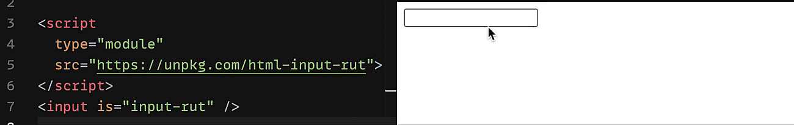

# HTML Input RUT

This module is a simple web component to create a input chilean RUT validation. Compatible with pure HTML and any framework (React, Vie, Angular, Other).

[](https://codesandbox.io/s/cool-worker-lvlxg?file=/index.html)

## Installing

Using **NPM**:

```sh
$ npm i html-input-rut
````

Using **UNPKG**:

```html
<script
  type="module"
  src="https://unpkg.com/html-input-rut">
</script>
```


## Usage on HTML

Add the HTML attribute `is` with value `input-rut` to the input element:

```html
<input is="input-rut" />
```

## Usage on a React Component

Import the module `html-input-rut` and use it in the component:

```jsx
import React from 'react'
import InputRut from 'html-input-rut'

export default () => {
  return (
    <input is={InputRut} />
  )
}
```

## License

[MIT](./LICENSE)
